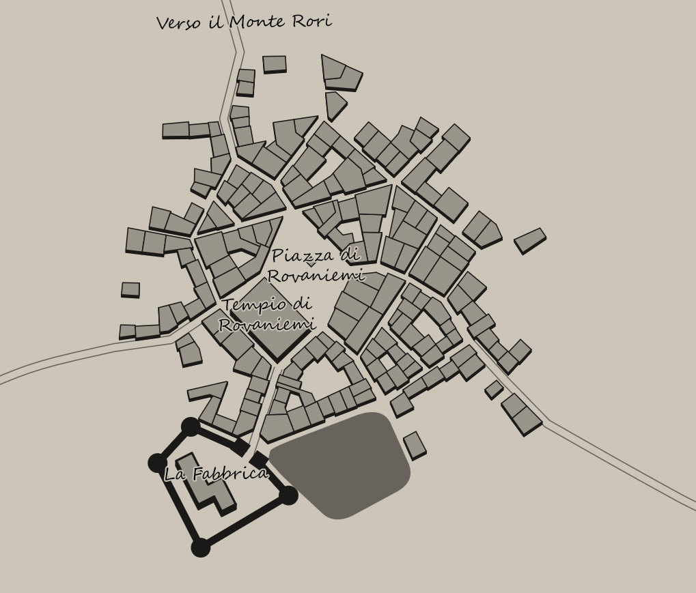
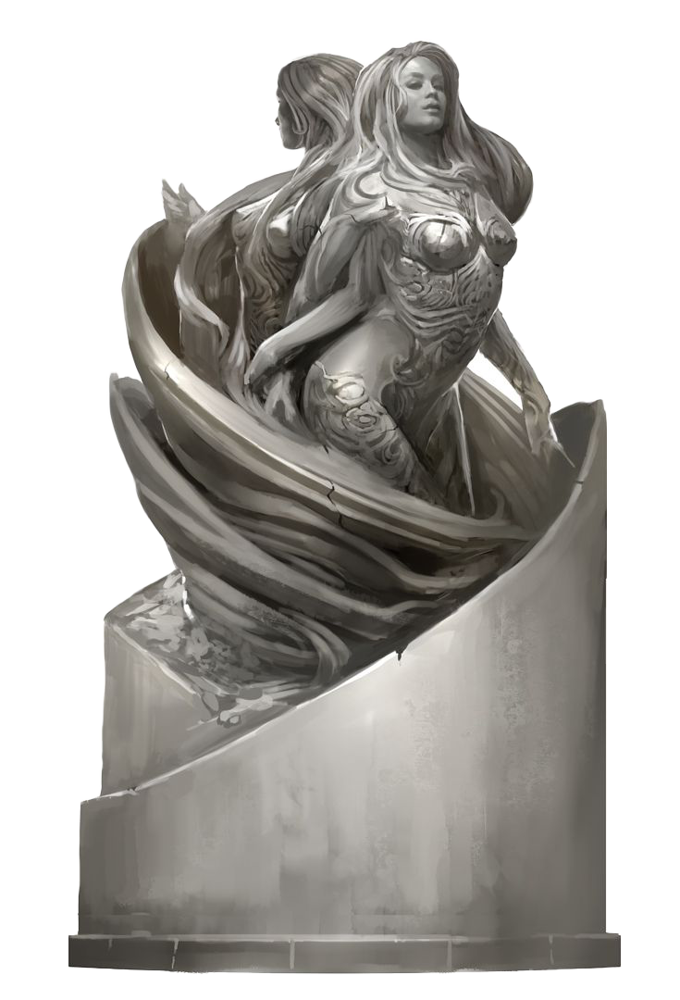

# Alcune note introduttive
Ciao, lettore di Giddierre.it!

Io sono Stefano, e questa è **Caos a Rovaniemi**: una breve avventura natalizia che ho scritto per *Giddierre.it*, allo scopo di farti passare una bella serata con i tuoi amici durante le feste!

Ti annoiero un pò con una breve introduzione NON inerente all'avventura in se, ma più al lavoro e al progetto che la circonda.
Incominciamo!

## Era un natale buio e tempestoso...
A dire il vero ti ho appena mentito: quella di *Caos a Rovaniemi* è un avventura che ho scritto l'anno scorso, nel 2021, per poter giocare con i miei amici a natale.

Beh, la shot **inizialmente** era concepita per un party di dieci giocatori: è stata un vero delirio masterararla, ma la cosa più importante è stata che ci siamo divertiti e abbiamo passato una bella serata insieme.

Sapendo che **il mio collaboratore in redazione, Leandro**, avrebbe scritto un artiolo su come scrivere una shot di natale, gli ho proposto di aggiungere al blog anche questa mia vecchia shot, che poteva ricollegarsi al suo articolo, l'idea gli è piaciuta e abbiamo deciso di farlo.

Quello che quindi ho fatto è stato recuperare dai miei appunti quela fantomatica shot, ribilandciare il tutto **per un party di 4 giocatori**, riscriverla in modo da trasformarla in un formato più piacevole e pulito e aggiungere introduzione che ora stai leggendo.
Eccola qui! la mia shot per il natale 2021, riproposta al grande pubblico nel 2022!
## Alcuni dettagli
Aggiungo di seguito alcuni dettagli sull'avventura che potrebbe essere utile sapere
### Giddierre.it
**Giddierre.it** è una community italiana sui **Giochi di Ruolo**. 

Scriviamo articoli e produciamo contenuti a tutto tondo sull'argomento.

Se hai ottenuto questa avventura perchè te l'ha passata un tuo amico, o chissà dove, ci farebbe tanto piacere se facesi un salto a trovarci su Giddierre.it per farci sapere cosa ne pensi! Ti aspettiamo!

### Nomi fittizi o nomi reali
Durante l'avventura vi sono alcuni nomi come "Babbo Inverno" e "Festa dei Fuochi Invernali", che sono chiaramente ispirati a concetti reali (negli esempi in oggetto, sono chiari riferimenti a "Babbo Natale" e "Natale").

E una mia scelta di gusto personale, ma sentitevi tranquilli nel utilizzare nomi alternativi o reali.

### Gli avventurieri e l'avventura
La shot è pensata e bilanciata per essere giocata da **4 personaggi** di **5o livello**.
Sono presenti **8 combattimenti** possibili, divisi in **6 atti** narrativi, pertanto la shot potrebbe richiedere circa **3-4 ore** per essere completata!
Siccome non è brevissima, assicurati che ci sia il tempo necessario per giocarla, in caso contrario potresti optare per dividere la shot in 2 parti (idealmente: **dall'atto 1 all'atto 3** e **dall'atto 4 all'atto 6**, in ogni caso, per non rompere il pathos, ti consiglio di terminare eventualmente la sessione alla fine di un atto)

### Lo spirito del natale
Il tono dell'avventura è molto rilassato, ci sono degli elementi pseudocomici con riferimenti a dettagli del mondo reale trasposti in ambientazione fantasy, mischiati a un avventura tutto sommato seria.

E studiata per essere adatta un pò a tutti, sia per chi ama un gioco dal tono particolarmente serio, sia da chi invece preferisce un gioco più scansonato.

Prima di iniziare a giocare è **essenziale** munirsi di:
- Maglioni natalizi imbarazzanti;
- Tazze da riempire (a scelta) cioccolata calda o la più classica birra;
- Spirito natalizia;
- Tanta voglia di divertirsi!

Fatto? Perfetto. Ora siete pronti per giocare!
Spero che questa shot faccia divertire te e i tuoi giocatori come ha fatto divertire noi.

Rinnovo a te e al tuo gruppo di gioco un **Buon Natale** da parte di tutta la redazione di *Giddierre.it* e vi auguro: **Buona Shot!**

\page

# Atto 1 - L'arrivo a Rovaniemi
**Rovaniemi** è una cittadina nella regione a nord del continente di Solus.

La cittadina nasce ai piedi del **Monte Rori**, un enorme monte alto 4900 metri che ha sulla sua cima un faro spento da tempo immemore.

Nonostante le sue modeste dimensioni (3000 abitanti), Rovaniemi attira ogni anno gente da tutto il continente in quanto **meta turistica** molto frequentata durante la **festa dei Fuochi Invernali**.

{{note
##### Curiosità: Rovaniemi
Il nome *"Rovaniemi"* in realtà non è inventato, ne scelto a caso.

**Rovaniemi** in realtà è il nome di una città Finlandese, per la precisione è il capoluogo della *Lapponia*.
E famosa per avere al suo interno il **Villaggio di Babbo Natale**, dove ogni anno arrivano le lettere dei bambini di tutto il mondo!
}}

## Dentro Rovaniemi
Durante la festa le strade si riempiono di luci, le piccole botteghe aprono anche nelle ore notturne e odori di arrosti, zuppe e dolci scaldano l’ambiente e il cuore di chi passeggia per le strade del borgo

Ovunque vi sono persone che festeggiano, che ridono e che fanno compere. In generale tra le persone a Rovaniemi vi è un clima caloroso e felice.

Il gruppo di avventurieri si trova all'entrata della cittadina di Rovaniemi.

Siccome la festa dei fuochi invernali si avvicina, hanno deciso di fare tappa proprio a Rovaniemi, una piccola cittadina turistica.

Gli avventurieri sono liberi di girare per la cittadina: potrebbero voler visitare un negozio di dolciumi, potrebbero voler fare un offerta al tempio di Rovaniemi, o potrebbero voler andare in una locanda a bere tutti insieme.

### Le botteghe di Rovaniemi
Le botteghe e le taverne che si affacciano sul borgo vendono di tutto, dolci, prodotti artigianali, birra, vino, idromele e alcolici vari, vi sono anche caffetterie, forni e pasticcerie.

Sulla strada sono anche nummerose bancarelle piene zeppe di articoli in esposizione e luci.

I luoghi al chiuso sono molto caldi, in contrasto con il freddo invernale all'esterno. Ogni bottega dovrebbe avere un suo odore, ad esempio una locanda potrebbe far sentire agli avventurieri odore di arrosto e birra appena spillata.

In vari luoghi intorno ad ogni bottega, locanda, bancarelle si possono trovare alcune casse con sopra il marchio "Winter Daddy’s Sweets & Co." con scritte "Fragile" e "Alto" sui lati.

### Il tempio di Rovaniemi 
Il tempo di Rovaniemi è un grande tempio bianco fatto in marmo.

Si affaccia sulla piazza principale della città dove vi è una grossa statua raffigurante una donna.

Nel tempio di Rovaniemi vi è un altare con una pietra trasparente che fluttua a mezz'aria. La pietra emana freddo e assomiglia al ghiaccio. 

A proteggere la pietra vi sono dei sacerdoti vestiti di blu che, se interpellati sulla pietra, dicono che essa sia la chiave che potrebbe spezzare una maledizione antica.

I sacerdoti però evitano di dare maggiori informazioni agli avventurieri, guardando male chi fa troppe domande.

{{note
##### La statua, la Pietra trasparente e la maledizione
E' a questo punto evidente che c'è un mistero che circonda la tranquilla città di Rovaniemi.

I giocatori non dovrebbero venire a sapere i retroscena dell'avventura già a questo punto in quanto potrebbe rovinare l'esperienza di gioco, ma *D&D 5 edizione* è imprevedibile e magari *qualche* informazione ben centellinata potrebbe dare uno slancio in più alla tua sessione. Pertanto eccoti alcune informazioni che i giocatori potrebbero riuscire a scoprire.

**La statua**. La statua raffigura la dea Yielris, il fiore di cristallo. Ella è la Dea del Ghiaccio e del inverno, ed è la protettrice di Rovaniemi.

**La maledizione**. La maledizione a cui si riferiscono i sacerdoti è la maledizione a cui è stato condannato *Quintoris*, un guerriero leggendario che osò sfidare Yielris, convinto di poterla battere facilmente.
Egli però fù stato sconfitto e per la sua insolenza Yielris lo maledì per 10000 anni.
}}

### La fabbrica
Un pò disclocata dal punto centrale della città, vi è una fabbrica circondata da delle mura e con del filo spinato in cima.

IL luogo a prima vista è una fabbrica di dolciumi, che porta l’insegna "Winter Daddy’s Sweets & Co.".
Fuori dalla fabbrica vi è un viavai di goblin in vesti "natalizie".
Ognuno di quesi ha una maglia rossa, con dettagli natalizi e il logo "Winter Daddy’s Sweets & Co."

I cancelli sono chiusi e la fabbrica è sorvegliata da dei goblin in abiti da lavoro.

I goblin ovviamente non fanno entrare nessuno che non sia addetto ai lavori.

\page

## Fuori da Rovaniemi
### Il cimitero di Rovaniemi 
Il cimitero è posto su una rupe a pochi km di distanza dalla cittadina. 

Vi sono alcune lapidi e dei mazzi di fiori davanti ad esse, l’aria è molto malinconica. 
Il lontananza, verso l'orizzonte rivolto dalla parte dello strapiombo della rupe, si vede una luce.

La luce infonde calma in chi la guarda e chi inizia a guardarla nota che solo per lui, in successione, iniziano ad apparire altre luci, come se fossero delle lucciole.

L'avventuriero ne lentamente incantanto, finche, dal nulla, la sua vista inizia a spegnersi e sopraggiunge la sua morte.

Dopodichè l’avventuriero si risveglia, consapevole di aver appena vissuto la sua morte in una dimensione parallela.

{{note
##### ... Cosa è appena successo?
Lo sò, lo sò, il capitolo soprastante è molto strano e sconclusionato.

In realtà che ho scopiazzato giocando al librogame "Fra Tenebra e Abisso: Il Marchio" di TEAsoft, ma perchè esiste in questa avventura?

A dire il vero, non ha alcun senso, se non quello di aumentare il mistero che circonda la città di Rovaniemi.
Questo pezzo è nato solamente per creare una distrazione, eper vedere quali congetture avrebbero fatto i miei player a fine sessione.

Quali strane forze circondano questo tranquillo borgo? Cosa è appena successo?

Queste sono solo alcune delle domande che i giocatori potrebbero farsi dopo l'evento che è appena accaduto.

Questa parte può essere uno spunto di trama per una successiva avventura nella stessa ambientazione, timanendo un punto senza risposta alla fine della shot.
}}

# Atto 2 - Caos a Rovaniemi!

Dopo qualche ora che gli avventurieri girano per la cittadina, si ode un esplosione, susseguita da altre numerose esplosioni.

La cittadina va nel panico, alcune case prendono fuoco, le esplosioni diventano sempre piu frequenti e in totale se ne verificano una ventina.

Se gli avventurieri esaminano bene la situazione, essi potranno accorgersi che ciò che sta succedendo: stanno esplodendo delle casse, casse che, tra l'altro, portano tutte la scritta "Winter Daddy’s Sweets & Co." e sono tutte vicino a negozianti di dolciumi.

Un ulteriore attenta analisi, può portare gli avventurieri ad accorgersi che l'unica zona non colpita è il tempio di Rovaniemi.

Le strade iniziano lentamente a disseminarsi di Goblin che distruggono e attaccano botteghe e bancarelle, fracasando le vetrine e distruggendo accessori.

## Il tempio
Quando gli avventurieri si recano nella piazza antecedente il tempio, **4 goblin** che stavano sorvegliando la zona, attaccano il party.

Se lo scontro si mette male per i Goblin, essi chiedono pietà e si arrendono.

In realtà è solo un modo per distrarre gli avventurieri mentre, dalle finestre dei palazzi che danno sulla piazza, altri **4 goblin** attaccano gli avventurieri, sorprendendoili.

La tatica dei goblin di fatto è quella di circondare il party, sfruttando la loro disattenzione nel non notare che vi sono dei goblin nelle case.

Finito lo scontro, quando gli avventurieri si entrano nel tempio, scoprono che i sacerdoti sono stati uccisi e la pietra trafugata.

{{monster,frame
## Goblin
*Umanoide piccolo (goblinoide), neutrale malvagio*
___
**Classe Armatura** :: 15 (armatura di cuoio, scudo)
**Punti Ferita**  :: 7 (2d6)
**Velocità**       :: 9 m
___
|  FOR  |  DES  |  COS  |  INT  |  SAG  |  CAR  |
|:-----:|:-----:|:-----:|:-----:|:-----:|:-----:|
| 8 (-1)|14 (+2)|19 (+5)|19 (+5)|10 (+0)|20 (+5)|
___
**Abilità**             :: Furtività +6
**Sensi**                :: Percezione passiva 9, scurovisione 18m
**Linguaggi**            :: Comune, Goblin
**Sfida**                :: 1/4 (15 PE)
___
***Fuga Agile.*** Il goblin può effettuare l'azione di Disimpegno o Nascondersi come azione bonus a ogni suo turno.
### Azioni
***Scimitarra.*** *Attacco con arma da mischia* +4 al tiro per colpire, portata 1,5m, un bersaglio. *Colpito* 5 (1d6 + 2) danni taglienti. 
:
***Arco Corto.*** *Attacco con arma a distanza:* +4 al tiro per colpire, gittata 24/96 m., un bersaglio. *Colpito* 5 (1d6 + 2) danni perforanti.
}}

\page

# Atto 3 - La fabbrica dei dolci

Arrivati alla fabbrica dei dolci, gli avventurieri notano subito l’insegna che recita "Winter Daddy’s Sweets & Co.

L’entrata della fabbrica è incustodita ed aperta, sembra come se qualcuno sia andato via di fretta e furia, lasciando tutto incustodito.

## La reception 
Entrati nella fabbrica vi è una reception.

Al bancone vi è un Goblin che legge un libro, esso è totalmente assorto e non presta attenzione agli avventurieri, purchè questi non facciano molto casino o non lo interpellino direttamente.

Se il Goblin viene interpellato, questi dà delle indicazioni sommarie su come diriggersi nell'ufficio del capo e torna velocemente al suo libro scocciato.

Dietro la reception vi è una porta che dà sulla *sala dei macchinari**

### La sala delle macchine
La sala è piena di rulli trasportatori, mentre a terra, sui lati della stanza è pieno zeppo di pacchi di cartone e casase di legno: vuoti, piegati e pieni.

Quasi tutti i macchinari nella sala sono fermi , tranne qualche nastro trasportatore che trasporta casse in altre aree della fabbrica.

Su un nastro fermo vi sono diversi pacchi incartati a mò di regalo, su uno di questi vi è una targhetta che recita:

*"Per Arthur, il mio guerriero preferito, amore tuo Fiona"* 

Il pacco, se aperto, rivela un **Arma +2** *(DMG pag.156)*. 

Vi sono 2 porte sulla destra una per le *Camerate*, una per le *Cucine* e una sulla sinistra per un *Corridoio.*

### Le Camerate
La sala vasta e con diversi letti a castello, a terra c'è molta confusione, ci solo dolci mangiucchiati, scaltole di cartone aperte e bottiglie rotte.

Ci sono 2 goblin che dormono, se gli avventurieri fanno casino, i goblin si svegliano e attaccano i membri del gruppo.

Nella stanza possono trovare sotto il letto di uno dei due goblin una **Borsa dei fagioli Magici** *(DMG pag.167)*.

### Le Cucine
Entrando nelle cucine gli avventurieri vedono delle lunghe tavolate e un bancone in fondo, probabilmente dove veniva servito il cibo. 

Dietro il bancone ci sono delle dispense contenenti tante scatolette di tonno.
### Il Corridoio
Il corridoio, molto lungo, ha una vetrata sulla destra, che permette agli avventurieri di vedere una sala, probabilmente dietro La sala delle macchine, dove vi sono diversi macchinari per l'assemblaggio di articoli.

In fondo al corridoio c'è una porta che permette di raggiungere **L'ufficio**

\page
### L'ufficio
L'ufficio è arredato con dei mobili in legno, un grande tappeto rosso e una scrivania al centro.

Nella stanza c'è un gruppo di tre Sacerdoti in abito blu.

Uno di questi ha un sacchettoi legato alla cintura e minaccia il party: *Avete fatto un errore a venire qui!"*.

I 3 Sacerdoti poi attaccano il gruppo.
Finito lo scontro uno dei sacerdoti in fin di vita dice ridendo: *"Avete fatto troppo tardi, il nostro capo ormai avrà ricevuto la pietra"*

{{monster,frame
## Sacerdote
*Umanoide piccolo (goblinoide), neutrale malvagio*
___
**Classe Armatura** :: 13 (giaco di maglia)
**Punti Ferita**    :: 27 (5d8 + 5)
**Velocità**        :: 7,5 m
___
|  FOR  |  DES  |  COS  |  INT  |  SAG  |  CAR  |
|:-----:|:-----:|:-----:|:-----:|:-----:|:-----:|
|10 (+0)|10 (+2)|12 (+1)|13 (+1)|16 (+3)|13 (+1)|
___
**Abilità**             :: Medicina +7, Persuasione +3, Religione +4
**Sensi**                :: Percezione passiva 13
**Linguaggi**            :: Due lingue qualsiasi
**Sfida**                :: 1/4 (15 PE)
___

***Eminenza Divina.*** Come azione bonus, il sacerdote può spendere uno slot incantesimo per far sì che il suo attacco con arma da mischia infligge 10 (3d6) danni radianti aggiuntivi. Il beneficio dura fino al termine del turno. Se il sacerdote spende uno slot di 2° livello o più alto, il danno aggiuntivo aumenta di 1d6 per ogni livello sopra il 1°.
:
***Eminenza Divina.*** Come azione bonus, il sacerdote può spendere uno slot incantesimo per far sì che il suo attacco con arma da mischia infligge 10 (3d6) danni radianti aggiuntivi. Il beneficio dura fino al termine del turno. Se il sacerdote spende uno slot di 2° livello o più alto, il danno aggiuntivo aumenta di 1d6 per ogni livello sopra il 1°.
:
***Eminenza Divina.*** Come azione bonus, il sacerdote può spendere uno slot incantesimo per far sì che il suo attacco con arma da mischia infligge 10 (3d6) danni radianti aggiuntivi. Il beneficio dura fino al termine del turno. Se il sacerdote spende uno slot di 2° livello o più alto, il danno aggiuntivo aumenta di 1d6 per ogni livello sopra il 1°.
:
***Incantesimi.*** Il sacerdote è un incantatore di 5° livello. La sua abilità da incantatore è la Saggezza (CD dei tiri salvezza degli incantesimi 13, +5 al colpire con attacchi con incantesimo). Il sacerdote ha preparato i seguenti incantesimi da chierico:

Trucchetti (a volontà): *fiamma sacra*, *luce*, *taumaturgia*

1° livello (4 slot): *cura ferite*, *dardo tracciante*, *santuario*

2° livello (3 slot): *arma spirituale*, *ristorare inferiore*

3° livello (2 slot): *dissolvi magie*, *guardiani spirituali*
### Azioni
***Mazza.*** *Attacco con arma da mischia* +2 al tiro per colpire, portata 1,5m, un bersaglio. *Colpito* 3 (1d6) danni taglienti. 
}}

# Atto 4 - Il monte Rori

Il monte Rori è un luogo innevato e silenzioso. La neve cade leggera e trasmette un senso di tranquillità al party.

Man mano che salgono il monte, gli avventurieri incontrano sempre piu neve e rimangono sempre più incastrati.

Per ogni ora di scalata, il party dovrà fare un ts a costituzione (CD 10+diff) o prendere un livello di affatricamento a causa del freddo e della stanchezza.

Riposare richiede un ts a costituzione (CD 8+diff) o prendere un livello di affatricamento a causa del freddo e della stanchezza, ionoltre gli effetti del riposo sono nulli.

Dopo 8 ore di scalata il party si trova sulla vetta del monte.

- 1 ora - (diff 1) x
- 2 ora -  (diff 2) x
- 3 ora -  (diff 2) x
- 4 ora -  (diff 3) Il party passa vicino a un gruppo di Coboldi alati. Se il party trasporta qualcosa di luccicante, 8 coboldi alati si scagliano sul party in volo, tentando di arraffare l’oggetto e scappare. Se riescono, il gruppo impiega un ulteriore ora per trovare il covo dei coboldi. x
- 5 ora -  (diff 3) Il party arriva ai margini di una foresta, se entrano nelle ore successive non riusciranno a trovare la via x
- 6 ora - (diff 4) Il party procede nella foresta, essa si fa sempre piu fitta e intricata, gli avventurieri sentono delle voci, ma se si girano non vedono nessuno. x
- 7 ora - (diff 4) Alla fine il party arriva in una radura, la radura sembra fittissima, al centro vi è un enorme albero.
Se il party entra nella radura, tutti gli alberi intorno si chiudono, bloccando ogni via di fuga.
L’albero al centro è un Trenant che chiede al party "Cosa siete venuti a fare qui?"
E possibile evitare lo scontro con della diplomazia.

Finito lo scontro, il Trenant capisce le intenzioni degli avventurieri e spiega tutta la situazione:

*"Capisco... Quindi siete, nonostante tutto, puri di cuore...
Vi aiuterò allora.
L’essere che state cercando invero, è in al faro di Yielris. 
Egli è Quintoris, colui che osò sfidare gli dei, ma oggi lo conoscono tutti come Babbo Inverno. 
Quintoris fù un guerriero leggendario che cadde combattendo contro la dea del gelo, Yielris appunto, il fiore di cristallo.
Ella non lo fini, ma invece maledì e obbligo Quintoris a redimersi per ciò che aveva fatto, costringendolo a consegnare regali, e cosi egli fece, per molto tempo anche per noi Trenant.
Ad occhio e croce, sono passati circa... 10000 anni, secondo il vostro calendario.
Quintoris ora trama vendetta, vuole vendicarsi di Yielris, vuole vendicarsi di Rovaniemi distruggendola, e il suo rancore è incontenibile.
Per favore, andate su al faro e placatelo."*

Il Trenant poi dice al gruppo di aspettare. Esso pronuncia delle parole druidiche e l’energia vitale degli alberi si riversa negli avventurieri del gruppo, curandoli.
Dopodichè gli alberi della radura si scansano formando una strada che li porta fuori dalla foresta e fino al faro.
- 8 ora - (diff 1) Il party arriva di fronte al faro.

\page

# Atto 5 - Il dungeon del faro
Gli avventurieri giungono dinnanzi al faro e notano che le porte sono sigillate.
**Entrata** Se un membro del gruppo pone la mano sulla porta questa penetra nella mente dell’avventuriero e gli provoca una fitta alla testa, dopodiche le porte si aprono.

**Piano terra** La stanza presenta due statue di due creature, e un enorme statua di una donna sulla parete, con le mani rivolte verso l’alto, a sorreggere un cristallo.
Appena i membri del gruppo interagiscono con la statua, gli occhi di essa si accendono di un violaceo e nella mente di chi hvi ha interagito risuona una voce 
*"OH TU CHE VUOI GIUNGERE SULLA SOMMITA DEL FARO, DIMOSTRA DI ESSERE DEGNO AFFRONTANDO I GUARDIANI PROTETTORI DEL FARO"*.
Le due statue diventano un Elementale dell’Acqua e un Elementale del Aria
Sconfitti gli elementali, dopo alcuni istanti il pavimento del faro inizia a tremare, trasformandosi in una sorta di ascensore, che porta il gruppo in cima alla torre.

**Tetto** La cima del faro presenta un enorme buco sulla sua sommità.
Vi sono li davanti 4 Sacerdoti, con in mano la pietra pronti a gettarla nel buco.
Una volta sconfitti, la piedra cade ai piedi del gruppo.
Essi fanno appena in tempo a raccoglierla che una figura mastodontica, appare dietro di loro.

\page

# Atto 6 - Lo scontro con Quintoris

Davanti al party si presenta una figura mastodontica, Babbo Inverno è davanti agli avventurieri.

Egli si avvicina minaccioso ed annuncia con voce gutturale "DATEMI, LA PIETRA!".

Se Babbo Inverno riesce a gettare la pietra nel faro, i suoi danni sono raddoppiati, dimezza tutti i danni e la sua CA aumenta di 3.

# Epilogo - Il ritrono a Rovaniemi

